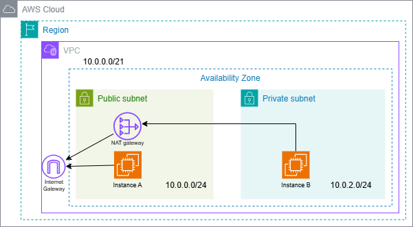

# 🛠️ AWS環境構築演習：NATゲートウェイ＆踏み台構成

## ✅ 概要  
パブリックサブネットに踏み台サーバ（インスタンスA）、プライベートサブネットに本番用サーバ（インスタンスB）を配置し、NAT Gateway経由でインターネットアクセスを実現する構成を構築。  
外部からのSSH接続はAを経由してBに接続する「踏み台構成」を学習。

## 🗂️ 構成図  


---

## 🔧 手順

### ① VPC作成  
- 東京リージョンを選択し、"VPC"サービスを開く  
- 「VPCを作成」→ CIDRは `10.0.0.0/21`  
→ 使用可能IPは `10.0.0.0 ~ 10.0.7.255`、以下のように8個の/24サブネットに分割できる：

10.0.0.0/24 パブリック用
10.0.2.0/24 プライベート用


### ② パブリック/プライベートサブネット作成  
- `10.0.0.0/24` をパブリックサブネット（test-subnet-a）として作成  
- 続けて `10.0.2.0/24` をプライベートサブネット（test-subnet-b）として作成  

### ③ インターネットゲートウェイ（IGW）作成  
- 「インターネットゲートウェイ」を作成 → VPCにアタッチ  

### ④ ルートテーブルの作成とサブネット関連付け  
- `rtb-subnet-a` → パブリックサブネット用（`test-subnet-a` に紐付け）  
- `rtb-subnet-b` → プライベートサブネット用（`test-subnet-b` に紐付け）  

👉 **ここまでで**：パブリックとプライベートのサブネット構成とルートテーブルの分離が完了。今後のセキュリティ設計の土台となる。

---

## ☁️ EC2とルーティング構成

### ⑤ パブリック用ルートテーブル作成  
- `rtb-subnet-a`に以下を追加：  
  - 宛先：`0.0.0.0/0`  
  - ターゲット：IGW  
→ パブリックサブネットのEC2がインターネット通信可能に  

### ⑥ プライベート用ルートテーブルはまだ`local`のみ（安全設計）  

---

### ⑦ パブリックサブネットにEC2（踏み台）作成  
- サブネット：`test-subnet-a`  
- パブリックIP：自動割当は無効  
- 名前：`test-ec2-a`

### ⑧ SSHキーペア作成  
- `.pem`ファイルをローカル保存（後で必要になる）

### ⑨ セキュリティグループ（踏み台用）作成  
- ポート22（SSH）→ 自分のグローバルIPのみに制限  
- 名前例：`test-sg-a`

---

## 🔐 踏み台→本番EC2構成

### ⑩ Elastic IP作成＆踏み台EC2にアタッチ  
→ このIPでSSH接続できるようになる

### ⑪ プライベートサブネットにEC2（本番）作成  
- サブネット：`test-subnet-b`  
- パブリックIP：無効  
- 名前例：`test-ec2-b`

### ⑫ セキュリティグループ（本番用）設定  
- ポート22を「踏み台EC2のセキュリティグループ」からのみ許可  
→ 外部からの直接アクセスは不可＝安全設計

---

### ⑬ Teratermなどで踏み台EC2にSSH接続  
- Elastic IPを使ってログイン

### ⑭ 踏み台へ秘密鍵（.pem）を転送  
- `/tmp/my-key.pem` にSCPで送る  
- 権限変更：

```bash
chmod 400 /tmp/my-key.pem
```

### ⑮ 踏み台経由でプライベートEC2にSSH接続
- ssh -i /tmp/my-key.pem ec2-user@10.0.2.x

## 🌐 NAT Gatewayの構成

### ⑯ NAT Gateway作成
- パブリックサブネット（test-subnet-a）に作成
- Elastic IPを割り当てる

### ⑰ プライベート側ルートテーブル（rtb-subnet-b）にルート追加
- 宛先：0.0.0.0/0
- ターゲット：NAT Gateway

### ⑱ 通信確認（本番EC2から）
- 以下を実行してレスポンス確認：

```
curl https://www.google.com
```

-- 👉 成功すれば、NAT Gateway経由でインターネット通信可能な構成が完成。セキュアかつ実用的な設計。

---

## 🧹 お片付け（リソース削除）
- EC2インスタンス（踏み台・本番）削除

- NAT Gateway 削除（Elastic IPの解放も忘れず）

- サブネット・ルートテーブル・IGW・VPC削除

## ⚠ NAT Gateway・EIPは放置すると課金され続けるので注意！
