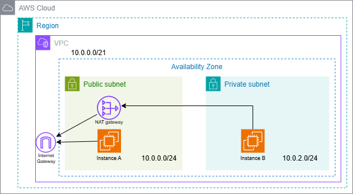

# AWS環境構築演習：NATゲートウェイ＆踏み台構成

## ✅ 概要
パブリックサブネットに踏み台サーバ（インスタンスA）、プライベートサブネットに本番用サーバ（インスタンスB）を配置し、NAT Gateway経由でインターネットアクセスを実現する構成を構築。  
外部からのSSH接続はAを経由してBに接続する「踏み台構成」を学習。

## 🗂️ 構成図

## 🔨 学習＆実践内容
- AWS課金額の確認と通知設定（SNSメール通知）
- IAMユーザー作成＆MFA（Google Authenticator）
- VPC、サブネット（パブリック/プライベート）作成
- IGW・NATGWの作成とルートテーブルの紐づけ
- EC2（踏み台A・本番B）作成＋Elastic IP設定
- TeraTermからA→BへのSSH接続
- `scp`, `ssh` によるファイル転送と接続確認
- EC2・VPC環境の削除手順の習得

## 💻 Linux基礎操作（実行コマンド例）
- `ls`, `cat`, `cp`, `touch`, `rm`, `mkdir`, `rmdir`, `cd`, `pwd`
- `chmod`, `echo`, `head`, `tail`, `less`, `grep`
- リダイレクション `>`, `>>`, パイプ `|`, AND `&&`, OR `||`
- サービス操作：`systemctl`

## 📘 学んだこと
- NATGWによるプライベートサブネットからの外部通信
- 踏み台経由のSSH接続フロー
- IAMと多要素認証によるセキュリティ強化
- リソース管理と削除によるコスト意識の向上
c
